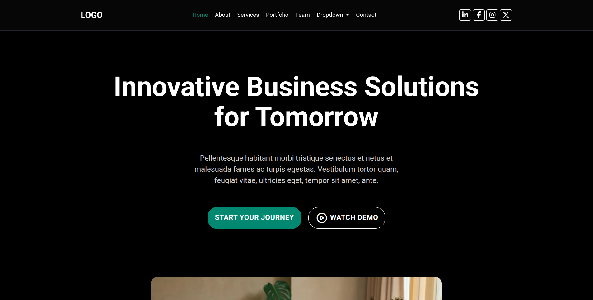

# 🚀 Modern Agency Landing Page
A sleek, fully responsive agency landing page built from scratch with modern web technologies. This project showcases advanced front-end development skills including smooth animations, interactive components, and professional UI/UX design principles.
✨ Features

- Fully Responsive Design - Seamlessly adapts to all screen sizes (mobile, tablet, desktop)
- Smooth Animations - Custom animations using USAL (Animate On Scroll) library for engaging user experience
- Interactive Swiper Carousels - Dynamic content sliders with touch support
- Modern UI/UX - Clean, professional design following current web design trends
- Performance Optimized - Fast loading times and smooth interactions
- Cross-browser Compatible - Works flawlessly across all modern browsers

## 🛠️ Technologies Used

- HTML5 - Semantic markup for better accessibility and SEO
- CSS3 - Modern styling with Flexbox and Grid layouts
- Bootstrap 5 - Responsive framework for rapid development
- JavaScript (ES6+) - Interactive functionality and animations
- Swiper.js - Touch-enabled slider/carousel library
- USAL Library - Scroll-triggered animations
- Vite - Next-generation build tool for faster development and optimized production builds

## 🎯 Key Highlights
This project demonstrates:

- Strong understanding of responsive design principles
- Ability to integrate multiple JavaScript libraries seamlessly
- Clean, maintainable code structure
- Modern development workflow using build tools
- Attention to detail in UI/UX implementation
- Performance optimization techniques

## 📦 Build Tool
Powered by Vite for:

⚡ Lightning-fast Hot Module Replacement (HMR)
- 📦 Optimized production builds
- 🔧 Modern development experience
- 🎯 Efficient asset handling

## 🚀 Getting Started
```
# Install dependencies
npm install

#### Run development server
npm run dev

#### Build for production
npm run build

#### Preview production build
npm run preview
```
## 💡 What I Learned
Through building this project, I enhanced my skills in:

- Creating smooth, performant animations
- Implementing complex UI components from scratch
- Managing project dependencies and build processes
- Writing clean, scalable front-end code
- Optimizing web performance

- Live Demo: [[Here](https://bootstrap-agency-landing-page.vercel.app)]
- Repository: [[Here](https://github.com/abdelilah-dev/Bootstrap-Agency-Landing-Page)]
